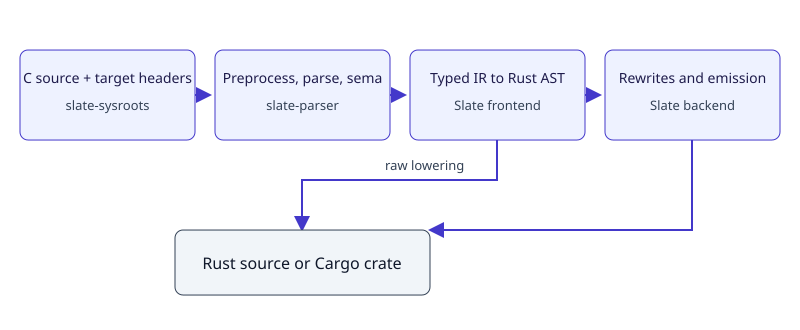

# Architecture

| Stage | Owner | Output |
| --- | --- | --- |
| Preprocessing, parsing and semantic analysis | `crates/slate-parser` | Typed `ir::Module` and source locations |
| Rust lowering | `crates/slate/src/frontend/lowerer` | `rust_ast::Program` |
| Analyses and rewrites | `crates/slate/src/backend` | Transformed Rust AST |
| Emission and formatting | Backend codegen and prettyplease | Rust source |
| Project generation | Slate CLI | Cargo crate and optional C runtime bridges |

C semantics, conversions and target layout belong to slate-parser. Slate
translates that typed IR directly. Unsupported constructs produce barriers;
broken IR invariants produce invalid-IR diagnostics.

`translate` runs the full backend pipeline; project generation runs its
control-flow subset. There is no raw lowering mode.

Target headers come from slate-sysroots. Supported whole-item directive
branches can be merged into Rust cfg items; project generation currently
requires one configuration per translation unit.

The [wiki architecture](https://github.com/takashiidobe/slate/blob/main/wiki/concepts/slate-architecture.md)
defines the source boundaries and command behavior.
