# Architecture

## Parse

`SLATE_CLANG` a Clang built with `CLANG_ENABLE_CIR=ON` is invoked once
per translation unit with the [macro dump plugin](./macro-dump-plugin.md)
attached, against `libc-shim`'s headers instead of the host's system libc
(`-nostdlib`, so the same invocation works for any target. See
[Cross Compilation](./compilation.md) and [Libc](./libc.md)). The
parsing stage emits CIR and AST.

- CIR (`-fclangir`), parsed by `src/cir` into a structured op-tree. CIR
  is the primary lowering input since it has already resolved types, linkage,
  and control flow, so lowering doesn't have to re-derive them from a raw
  AST.
- The Clang AST (`-ast-dump=json`), parsed by
  `src/frontend/c_ast.rs`. CIR throws away doc comments, macro identity, header
  provenance for libc calls, bit-field widths, packing attributes, and exact
  `long double` bit patterns so these come from the AST (and from the
  macro dump plugin's provenance events) instead. More details in
  [Clang AST Integration](./clang-ast.md).

## Lower

`src/frontend/lowerer.rs` walks the CIR op-tree and looks up AST-side facts
by source-location offset as it goes, producing baseline Rust: correct
but intentionally unpolished `unsafe`, `#[repr(C)]`, raw pointers,
explicit temporaries. Correctness at this stage is checked by differential
testing (compile + run the C, compile + run the Rust, require identical
stdout and exit code), not by how the output looks.

## Analyze

Baseline Rust is not idiomatized in place. `src/backend/facts` runs
read-only analysis over the lowered `Program`, like callers, purity,
etc. This is the shared fact base every fixup pass queries instead of
re-deriving the same analysis independently.

## Rewrite

`src/backend/query/rules` holds the fixup passes themselves. Each is a
`QueryRule` that selects candidates, checks preconditions against
`src/backend/facts`, and returns an edit set; `src/backend/mod.rs` runs a
fixed, hand-written sequence of these passes over the `Program`. They
recover idiom safe references, `Vec`/`Box`, `for x in ..`, compound
assignment without changing behavior, and each pass is independently
verified the same way baseline lowering is (differential testing), so
disabling any one of them still leaves correct Rust. More in
[Rewriting](./writing-a-rewrite.md).

## Cross compiling

This whole pipeline runs once per preprocessor configuration when a file
branches on `#ifdef`/target macros, and the resulting programs are merged
behind Rust `#[cfg(...)]` see
[Translate Directives](./translate-directives.md) for that mechanism.
