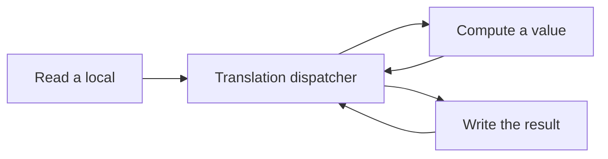

# SQLite runtime performance

<!-- toc -->

- [Experiment](#experiment)
- [Why statement dispatch was expensive](#why-statement-dispatch-was-expensive)
- [Basic-block coalescing](#basic-block-coalescing)
- [Structured control flow](#structured-control-flow)
- [What the instruction measurements mean](#what-the-instruction-measurements-mean)
- [Reproduce](#reproduce)
<!-- /toc -->

## Experiment

- SQLite `speedtest1 --memdb --verify --size 50 --testset cte`; the same C driver links each library.
- CTE is the measured recursive-query workload, not the entire SQLite correctness suite.
- Clang `-O2 -g -fPIC`; Rust release; identical SQLite source, feature defines, and headers.
- The fresh historical generated `sqlite3.rs` is byte-for-byte identical to the retained original baseline source.
- Historical build: clean detached worktree at `1a5e11ffeea2f459aa1f0d7a13709d2986535676`.
- Intermediate: `07f1b47d4`, basic-block coalescing. Final: `eb8df90ba`, project control-flow rewrites.
- `f8a43a42e` added profiling, with no Slate/parser Rust changes from `1a5e11ffe`.
- Original [baseline](../log/2026-10-01-22-24.md): CTE **24.379 seconds / 58.33× Clang**. The near-60 figure was the slowdown ratio.
- Previous [main-workload profile](../log/2026-10-01-22-39.md): **28.57× retired instructions**, across the whole workload, not a counted loop body.

- Fresh measurements on 2026-10-02: pinned to logical CPU 4, with compilation/tests finished; one warmup and five alternating samples per stage.
- [Saved evidence](../../tools/benchmark/results/sqlite-cte-2026-10-02.json) includes samples, spread, hashes, compilers, flags, artifact identities, and counters.
- One Clang reference: **0.481s**. Native batch medians were 0.481s/0.495s/0.470s; all verification hashes match.

| Stage                    | Commit      | CTE Rust median | Speedup from previous | Total speedup | Rust / Clang reference |
| ------------------------ | ----------- | --------------: | --------------------: | ------------: | ---------------------: |
| Statement-level dispatch | `1a5e11ffe` |         26.584s |                 1.00× |         1.00× |                 55.26× |
| Coalesced basic blocks   | `07f1b47d4` |          2.703s |                 9.84× |         9.84× |                  5.62× |
| Structured regions       | `eb8df90ba` |          0.501s |                 5.40× |        53.10× |                  1.04× |

- The final batch itself measured 0.470s native / 0.501s Rust (1.06×); the retained-reference ratio above is 1.04×.
- An earlier unpinned rerun, 0.343s native / 0.358s Rust, is consistent with this near-native result. Compare ratios within a batch rather than absolute times across CPU placement or frequency changes.
- Intermediate/final libraries reuse previously validated artifacts and are remeasured here. Their `build.json` records the parent revision plus `source.patch`; the table names the commits that landed those patches.
- The historical build took 200.7s for the Rust library and 218.6s for the shell, compiling the core separately. Build time is separate from CTE runtime.

## Why statement dispatch was expensive

- Functions containing `goto` used a function-wide state machine.
- Each statement or evaluation could become a separate state; ordinary sequential work repeatedly returned to `match __slate_state`.
- VDBE generated 3,696 states and 4,492 static dispatcher transfers.
- Every state could reach the common header. Its many incoming paths merged live values and limited LLVM's ability to keep them in registers.
- Assembly exposed stack copies around that header; the original CTE profile placed 62.64% of all sampled cycles in its 318-byte range and 93.04% at VDBE stack-move instructions.
- The source C has its own VM opcode dispatch. Translation added another dispatch layer between ordinary statements within each opcode.

Illustrative translation edges:



Coalescing makes the sequential edges explicit:


- This cost came from generic control-flow lowering, not from SQLite's recursive-query algorithm.
- [IR control flow](ir/control-flow.md) preserves source structure; [Rust rewriting](rewrite-engine-v2.md#control-flow-rewrites) recovers it after lowering.

## Basic-block coalescing

| Transformation                                             | Effect                                                    |
| ---------------------------------------------------------- | --------------------------------------------------------- |
| Thread empty forwarding jumps, preserving cycles           | Skip redundant state transfers                            |
| Prune unreachable CFG nodes                                | Emit only reachable states                                |
| Keep entry, joins, and branch/switch successors as leaders | Preserve alternate entry points                           |
| Combine sequential nodes between leaders                   | Execute an entire straight-line block before transferring |
| Emit only the terminal transfer                            | Remove per-statement dispatcher round trips               |

- Implementation: `Graph::blocks` in [control_flow.rs](../../crates/slate/src/frontend/lowerer/control_flow.rs).
- VDBE: 3,696 → 1,130 states; 4,492 → 1,927 static dispatcher transfers.
- Operations stay in order; raw local slots remain hoisted. Skipped initializers, escaping addresses, volatile access, and goto cycles retain their semantics.
- Recorded CTE improvement: [21.323s → 2.080s, 10.25×](../log/2026-10-02-08-24.md).
- The common header remained: 45.26% of coalesced CTE sampled cycles; VDBE stack moves received 63.75%.
- Fewer dispatcher trips helped substantially, but a global merge point still constrained optimization.

## Structured control flow

| CFG region                     | Recovered Rust                                     |
| ------------------------------ | -------------------------------------------------- |
| Acyclic branches               | `if` / `match` with labeled join blocks            |
| Natural loops                  | `loop`, refined by existing while/for peepholes    |
| Irreducible multi-entry cycles | A localized selector at the SCC entry              |
| Fallthrough switches           | Retained switch recovery, with bounded duplication |

- Project generation previously bypassed the retained backend. `eb8df90ba` enables its control-flow registry after frontend coalescing.
- Recognition now accepts current dispatcher names, `usize` states, arm-local transfers, and void exits.
- Nested decisions stay in their original blocks to preserve selector scope and evaluation order. Loop transfers retain labels across labeled joins.
- Generic algorithms are reused: [structure_goto.rs](../../crates/slate/src/backend/engine/rules/structure_goto.rs), [reducible.rs](../../crates/slate/src/backend/engine/rules/structure_goto/reducible.rs), and [structure_dispatch.rs](../../crates/slate/src/backend/engine/rules/structure_dispatch.rs).
- VDBE has zero transfers through the function-wide dispatcher; one localized selector remains. It still has the original SQLite opcode dispatch.
- Direct control-flow edges expose narrower joins and natural loops to LLVM. The observed smaller code and fewer retired instructions support the explanation that dispatch/merge work was removed.
- No new local-storage or pointer-representation optimization was required. Exported C signatures and stable storage remain intact.
- `translate-project --raw` disables backend structuring, while retaining frontend coalescing. It does not reconstruct the historical statement-level dispatcher.
- Full Slate differential coverage includes 31 optimized goto/switch fixtures and project linkage. All three measured stages pass matching hashes and the ten SQL/C API/WAL/interrupt checks.

## What the instruction measurements mean

| Measurement                     | Scope                                                                            |
| ------------------------------- | -------------------------------------------------------------------------------- |
| Retired `instructions:u`        | User-mode execution of the complete CTE driver and linked library                |
| Static disassembly instructions | All instructions emitted in `sqlite3VdbeExec`, including cold code               |
| VDBE machine bytes              | Function code size, not its executed instruction count                           |
| Stack allocation                | Prologue stack subtraction, excluding saved registers                            |
| Runtime ratio                   | Elapsed time; affected by frequency, scheduling, and different instruction costs |

- A 1.04× runtime ratio does not establish 1.04× instructions in a particular loop.
- The current stack allocation can remain larger than Clang's even when runtime is close; frame size alone does not count hot-path copies.
- Whole-workload counters establish whether the earlier instruction inflation remains; per-loop claims require separately isolating and counting that loop.
- Keep CPU placement and workload flags fixed, run outside builds/tests, and compare the same verification hash.

Each counter is one additional verified CTE execution on CPU 4; all events ran for 100% of the measurement interval. `perf stat` timing is separate from the five-run medians above.

| Stage                    | Retired instructions | Instructions / Clang |          Cycles | Cycles / Clang |
| ------------------------ | -------------------: | -------------------: | --------------: | -------------: |
| Clang                    |        5.708 billion |                1.00× |   1.587 billion |          1.00× |
| Statement-level dispatch |      227.127 billion |               39.79× | 100.887 billion |         63.58× |
| Coalesced basic blocks   |       29.183 billion |                5.11× |   9.804 billion |          6.18× |
| Structured regions       |        6.204 billion |                1.09× |   1.700 billion |          1.07× |

| Whole VDBE function      | Machine code bytes | Static instructions | Prologue stack allocation |
| ------------------------ | -----------------: | ------------------: | ------------------------: |
| Clang                    |             51,745 |              11,630 |                 488 bytes |
| Statement-level dispatch |          1,171,261 |             200,135 |               6,360 bytes |
| Coalesced basic blocks   |            163,370 |              35,211 |               3,160 bytes |
| Structured regions       |             35,064 |               7,952 |               1,176 bytes |

- Static counts include cold paths and alignment instructions; objdump byte-continuation lines are excluded.
- The fresh historical VDBE machine-code bytes match the retained original baseline exactly.
- CTE executed-instruction inflation fell from **39.79× to 1.09×**; VDBE machine-code size fell from **22.64× to 0.68×** Clang.
- Current generated CTE executes slightly more instructions than Clang despite having smaller total VDBE code. Hot-path work and total emitted code measure different things.

## Reproduce

Run from the workspace root. Full driver/build documentation: [SQLite benchmark runner](../../tools/benchmark/README.md).

```bash
git worktree add --detach target/worktrees/sqlite-1a5e11f 1a5e11ffeea2f459aa1f0d7a13709d2986535676
python3 tools/benchmark/sqlite.py --slate-root target/worktrees/sqlite-1a5e11f \
  --label historical-1a5e11f --build-only
taskset -c 4 python3 tools/benchmark/sqlite.py \
  --label historical-1a5e11f --skip-build --testsets cte
python3 tools/benchmark/sqlite.py --label structured-current --build-only
taskset -c 4 python3 tools/benchmark/sqlite.py \
  --label structured-current --skip-build --testsets cte --compare historical-1a5e11f
```

- `--skip-build` reuses artifacts; `--compare-only` reports saved measurements.
- To rebuild the intermediate stage, create a worktree at `07f1b47d4` and pass it through `--slate-root`.

```bash
taskset -c 4 perf stat -e cycles:u,instructions:u,branches:u,branch-misses:u -- \
  target/sqlite-benchmark/structured-current/runtime/speedtest1-generated \
  --memdb --verify --size 50 --testset cte
```
